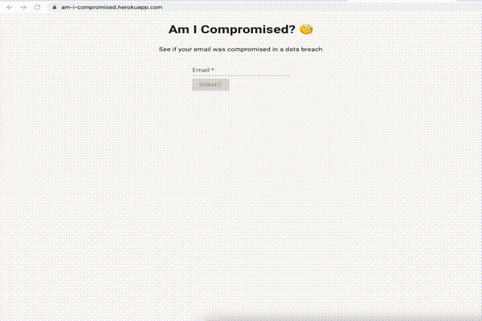

# Data breach checker
This is a tool powered with React and Node to check if your email has been compromised in any data breaches; using the [haveibeenpwned](https://haveibeenpwned.com/) API.



## Technologies
- React
- Material UI
- NodeJS
- Express

## Setup
To run this project, install locally using npm.

Starting client:
```
$ cd am-i-compromised/client
$ npm install
$ npm start
```
Starting server:
```
$ cd am-i-compromised/server
$ npm install
$ npm start
```

## Future
- Reduce server load: cache emails that have already been checked
- Pagination (I did not see [HIBP API](https://haveibeenpwned.com/API/v3) directly support this)
- Integrating GraphQL for client side querying and serving up data
- Typescript instead of PropTypes
- Terraform usage
- Refactor server code into better directory structure - routes, controllers, services
- Move search and filtering to server side, debounce frontend input
- Move components that deal with api into container components and pass down data as needed
- Adding Error Boundaries with fallback components
